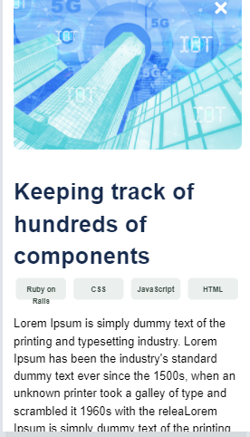

# Milan Protic's Personal-Portfolio - Pop-up window

- Desktop version:

- Mobile version:

# BUILT WITH
- HTML
- CSS
- JavaScript

## Getting Started

- To clone this project:
- Run command: $git clone [name of the repo].
- Press the green Code button in the upper right corner and choose to download from the Download ZIP link.

# LIVE DEMO

- [Personal Portfolio](https://mprotic123.github.io/personal-portfolio)

# AUTHORS

👤 **Milan Protić**
 

- Github :  [@mprotic123](https://github.com/mprotic123) 
- Linkdn :  [Milan Protić](https://www.linkedin.com/in/milan-proti%C4%87-040364213/) 
- Twitter: [@proticm98](https://twitter.com/proticm98)

👤 **Daniel Owiri**

- GitHub: [@DannieMo](https://github.com/DannieMo)
- LinkedIn: [Daniel Majesty Owiri](linkedin.com/in/daniel-majesty-owiri-85175616b)

# 🤝 Contributing
Contributions, isses, and feature requests are welcome!
Feel free to check the issues page.

# Show your support
Give a ⭐️ if you like this project!

# 📝 License
This project is MIT licensed.
