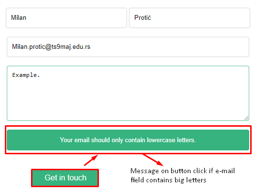

# Portfolio

> Assigment from Microverse: Copy of a Portfolio design from Figma Template

## Built With

- HTML
- CSS (using Flex and Grid)

## Getting Started

**To clone this project**
**Run command: $git clone [name of the repo]**
**or press the green Code button in the upper right corner and choose to download from the Download ZIP link.**

### Prerequisites

- Code editor (VS Code, Sublime, Atom)

## Authors

👤 **Author1**

- GitHub: [@mprotic123](https://github.com/mprotic123)
- Twitter: [@proticm98](https://twitter.com/proticm98)

## Show your support

Give a ⭐️ if you like this project!

## 📝 License

This project is [MIT](./MIT.md) licensed.
